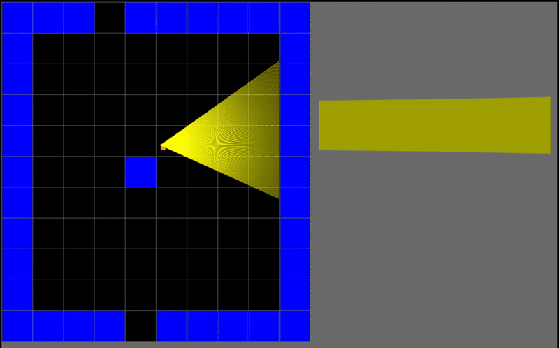

This is a raycast 3D viewer made in JS. It came to be when I first watched this video: https://www.youtube.com/watch?v=gYRrGTC7GtA
I tried to translate all the C code to JS and make some functions of my own to use the JS Canvas as my graphics viewer, using only rectanles and lines to create all the project.

